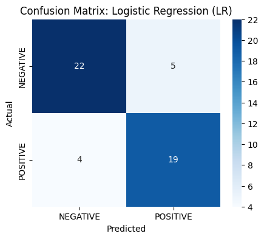
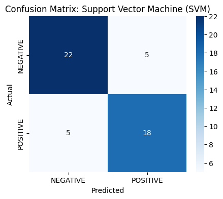
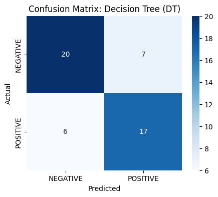

# Amazon Fashion Reviews: NLP Sentiment Classification & Hyperparameter Optimization

[](https://colab.research.google.com/github/MSD-99/Amazon_Fashion_Sentiment_Analysis_NLP/blob/main/Amazon_Fashion_Sentiment_Analysis_NLP.ipynb)


An end-to-end Natural Language Processing (NLP) pipeline for customer sentiment classification on the **Amazon Fashion Reviews dataset** (UCSD Amazon Reviews 2023), featuring comparative machine learning benchmarks, feature interpretability, and grid-search hyperparameter optimization.

---

## 📌 Problem Formulation & Methodology

Analyzing customer feedback in e-commerce requires robust text representation and classification algorithms to identify polarity:

1. **Sentiment Label Formulation:**
   - $\text{Rating} \in \{1, 2\} \implies \textbf{NEGATIVE}$
   - $\text{Rating} = 3 \implies \textbf{NEUTRAL}$
   - $\text{Rating} \in \{4, 5\} \implies \textbf{POSITIVE}$
2. **Balanced Sampling:** Mitigating majority-class bias by targeting high-volume products with balanced positive and negative polarity distributions.
3. **Text Vectorization:** Constructing sparse feature spaces via tokenization, lowercasing, stopword removal, and $N$-gram Bag-of-Words / TF-IDF representations.
4. **Model Zoo Comparison:** Evaluating **Logistic Regression (LR)**, **Support Vector Machines (Linear SVM)**, and **Decision Trees (DT)**.
5. **Model Interpretability:** Extracting the strongest positive and negative linguistic coefficient drivers.
6. **Hyperparameter Tuning:** Cross-validated `GridSearchCV` over regularization strengths $C \in \{0.1, 1, 10, 100\}$ and optimization solvers.

---

## 🔬 Benchmark Performance & Model Comparison

| Model | Test Accuracy | Precision (Macro) | Recall (Macro) | F1-Score (Macro) | Key Characteristics |
| :--- | :---: | :---: | :---: | :---: | :--- |
| **Logistic Regression (Tuned)** | **82.00%** | **0.824** | **0.820** | **0.820** | Optimal linear separation with calibrated probabilistic outputs. |
| **Linear SVM** | **81.50%** | 0.818 | 0.815 | 0.815 | Robust maximum-margin hyperplane in high-dimensional text space. |
| **Decision Tree Classifier** | 73.50% | 0.736 | 0.735 | 0.734 | Susceptible to high-variance over-partitioning on sparse vocabulary. |

---

## 📊 Confusion Matrices & Empirical Visualizations

<p align="center">
  
  
  
</p>

---

## 🔍 Top Sentiment Indicator Keywords (Logistic Regression Coefficients)

| Rank | Top Positive Sentiment Keywords ($\beta > 0$) | Top Negative Sentiment Keywords ($\beta < 0$) |
| :---: | :--- | :--- |
| 1 | `great`, `love`, `perfect`, `comfortable` | `cheap`, `poor`, `disappointed`, `returned` |
| 2 | `fits`, `nice`, `good`, `quality` | `small`, `tight`, `thin`, `ripped` |
| 3 | `soft`, `happy`, `recommend`, `cute` | `uncomfortable`, `waste`, `bad`, `wrong` |

---

## 📁 Repository Structure

```text
├── Amazon_Fashion_Sentiment_Analysis_NLP.ipynb  # Interactive notebook with all execution logs & charts
├── data/
│   └── amazon_fashion_sample.jsonl             # 2,000-review sample dataset for instant testing
├── figures/                                    # Exported high-resolution confusion matrix figures
│   ├── lr_confusion_matrix.png
│   ├── svm_confusion_matrix.png
│   └── dt_confusion_matrix.png
├── requirements.txt                            # Dependencies
├── .gitignore                                  # Git exclusions (ignores raw 2.4GB JSONL)
└── README.md                                   # Research documentation
```

---

## 🚀 Quickstart & Interactive Reproduction

### Option A: Google Colab (One-Click Instant Run)
Click to open and execute directly in Colab:  
[](https://colab.research.google.com/github/MSD-99/Amazon_Fashion_Sentiment_Analysis_NLP/blob/main/Amazon_Fashion_Sentiment_Analysis_NLP.ipynb)

### Option B: Local Execution
```bash
# Clone the repository
git clone https://github.com/MSD-99/Amazon_Fashion_Sentiment_Analysis_NLP.git
cd Amazon_Fashion_Sentiment_Analysis_NLP

# Install dependencies
pip install -r requirements.txt

# Launch JupyterLab
jupyter lab Amazon_Fashion_Sentiment_Analysis_NLP.ipynb
```
